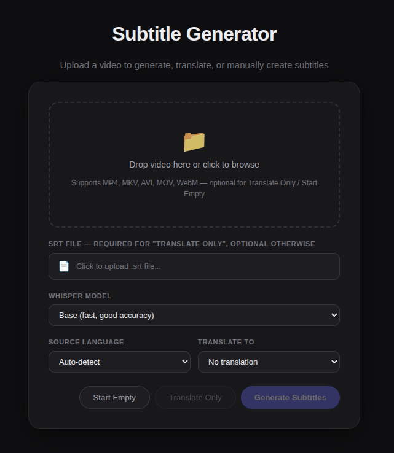
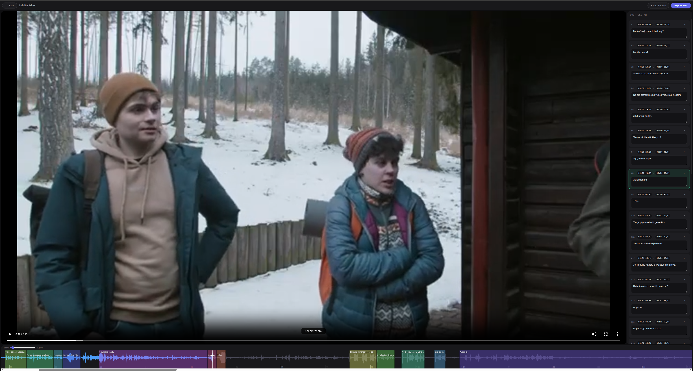

# Vibing subtitles
Fancy vibe-coded web subtitle generator and editor bcs I had to procrastinate doing something.

## How to use

There's a variety of options to select from:

### 1. Create subtitles manually from scratch
Select the `Start Empty` option and you can manually create subtitles in the graphic editor. You should also upload the corresponding video for visual and audio feedback.

### 2. Edit existing subtitles file
If you upload both video and its .srt file, you can select `Generate Subtitles`. The subtitles won't be regenerated, instead, the current .srt file will be loaded and you can edit it manually.

### 3. Generate subtitles automatically
Upload video for which you want to generate the subtitles, select whisper model to use (recommended is the `largest`, its still fast), the source language (or leave on auto-detect, however it might make mistakes) and hit `Generate Subtitles`. Optionally, you can select a language to which the subtitles should be translated. After all processes end, the edit page will open and you can check and edit the subtitles further.

### 4. Translate only
Upload the subtitles file and optionally the source video, set the desired language and hit `Translate Only`. Only translation will be performed and the edit page will open for preview and manual editing.

## Edit page

In the edit page you have video preview, scrollable audio vaweform and sidebar with the subtitles parts. You can add, edit, delete the subtitles in the sidebar and change timing in the waveform overlay.

To export the subtitles, just select `Export SRT`

## Disclaimer

Whisper AI is just an AI and still makes a lot of errors, the same goes for the translation that is done using OSS LLM models. There still has to be done some work on the translation. However, this tool is great to lay some base for subtitles or just as an easy UI for subtitles creation and editing.
